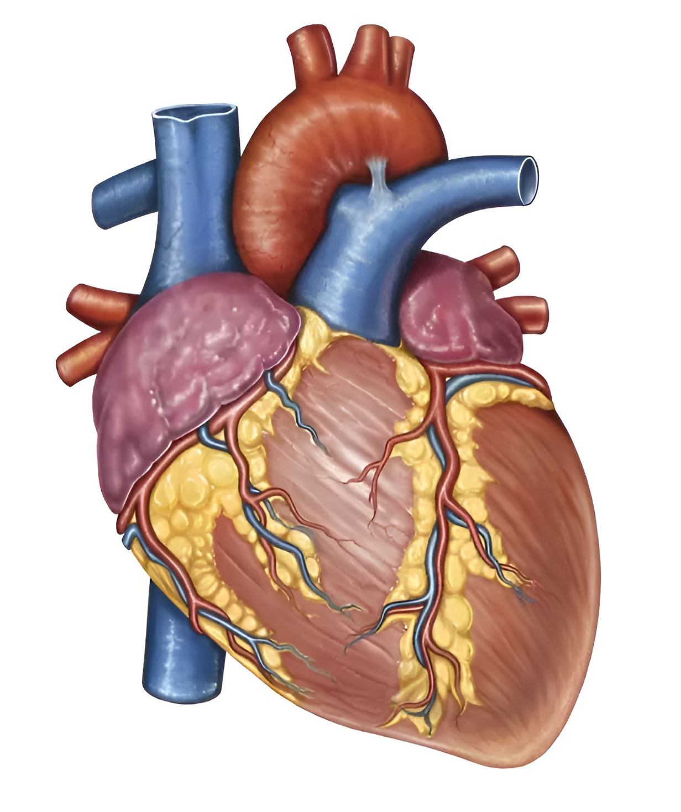

# SkunkworksAI/BakLLaVA-1 Cog model

This is an implementation of the [SkunkworksAI/BakLLaVA-1](https://huggingface.co/SkunkworksAI/BakLLaVA-1) as a Cog model. [Cog packages machine learning models as standard containers.](https://github.com/replicate/cog)

## Basic usage

Before running the image, you need to fetch the weights:

    cog run python script/download-weights

You can then run the image with:

    cog predict -i image=@heart.jpg -i prompt="Describe this image"

## Example:

Input:

"Describe this image"

Output:

The image features a detailed, colorful illustration of a human heart. The heart is shown from the front, with its various chambers and blood vessels clearly visible. The heart's interior is shown in cross-section, revealing its intricate structure.
